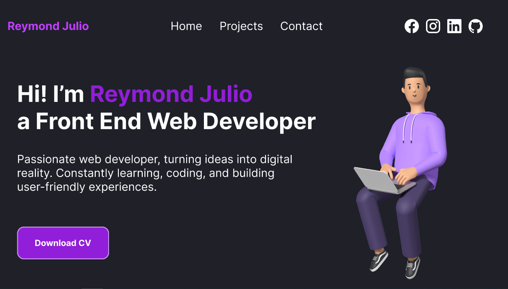

# Personal Website of Reymond Julio

Hi there ✋

I'm **Reymond Julio**, a student majoring in Communication Science at Multimedia Nusantara University. I :heart: coding and I'm currently changing careers to become a Software Engineer 💻.

Welcome to my personal website 🙂. My personal website is made with Figma, HTML, and CSS technology. This design was inspired by [Kent C. Doods](https://kentcdodds.com/) and [Josh W Comeau](https://www.joshwcomeau.com/) websites.

## My Design

https://www.figma.com/file/AZIEHUxBIkhiBD7hm0hs4n/reymondjulio.com?type=design&node-id=0-1&t=vdLbwdpoVBK3gxZ8-0

## My Links

- Website: [reymondjulio.com](https://reymondjulio.com)
- Github: [@reymondjulio](https://github.com/reymondjulio)
- Linkedin: [reymondjulio](https://www.linkedin.com/in/reymondjulio/)
- Facebook: [reymondjulio](https://www.facebook.com/Rey.Yoe/)
- Instagram: [@reymondjulio](https://www.instagram.com/reymondjulio/)

## My Skills

1. Code Editor and Visual Studio Code
2. Markdown
3. Git and GitHub
4. Figma
5. HTML
6. CSS
7. JavaScript

## Pages

- Home: the home page contains my bio, my skills, my project and how to contact me.
- Project: the project page to view my projects or portfolio.
- Contact: the contact page to contact me by sending an email.

## Color Palette

| Color        |   Hex   |
| ------------ | :-----: |
| Black        | #1F2028 |
| Light Black  | #131317 |
| White        | #FFFFFF |
| Light Purple | #be3ffa |
| Dark Purple  | #911ED8 |
| Orange       | #E67E22 |
| Dark Blue    | #2F0449 |
| Light Blue   | #1C7ED6 |
| Yellow       | #F6CF00 |
